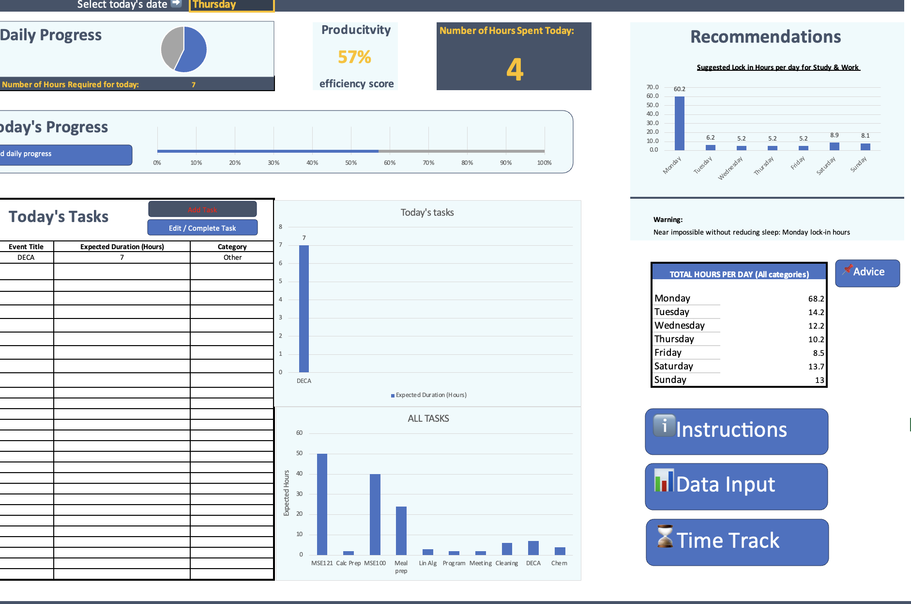
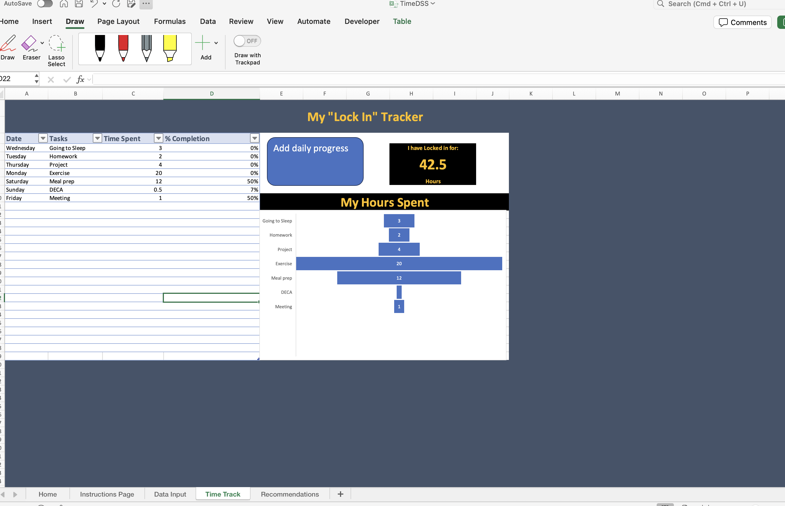
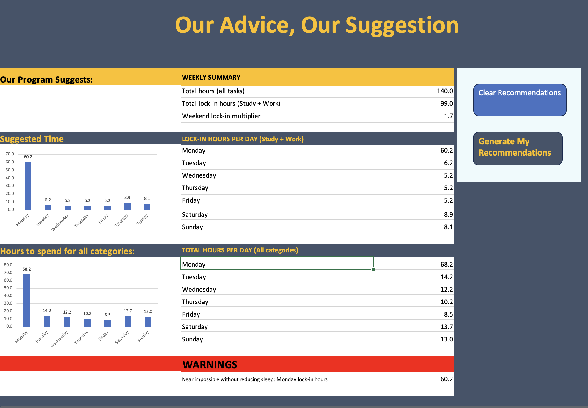

# TimeDSS — VBA Excel Time Tracker (MSE 100 Final Project)

A VBA-powered Excel dashboard for planning your week, tracking daily progress, and generating “lock-in” recommendations (study + work) based on the tasks you’ve entered.

> **Important:** This workbook is designed to be used **through the buttons/forms** (Add Task, Edit/Complete, Add Daily Progress, Generate Recommendations), **not by manually editing the dashboard tables**.

---

## Screenshots

**Home Dashboard**

**Data Input (All Tasks on Hand)**

**Time Track (Log progress + hours breakdown)**

**Recommendations (Weekly summary + suggested lock-in hours)**

---

## What this tool does

### Core features
- **Weekly task planning**: store tasks with expected hours, category, and due day.
- **Daily dashboard**: view tasks scheduled for a selected day and see progress metrics.
- **Progress logging**: log time spent + completion % to track real progress.
- **“Lock In” analytics**:
  - Total hours on hand (remaining workload)
  - Hours spent today
  - Productivity/efficiency score
  - Suggested lock-in hours per day (study + work)
  - Warnings when targets are unrealistic (ex: too many hours in a day)

---

## Workbook navigation (main pages)

You’ll mainly use these tabs (names may vary slightly, but the layout matches the screenshots):

- **Home (Dashboard)**  
  Daily view: tasks for the selected day, progress bars, hours spent today, productivity score, quick navigation buttons.
- **Instructions Page**  
  Embedded usage instructions inside the workbook UI.
- **Data Input**  
  “All Tasks on Hand” table + workload visualization (bar chart) and buttons for adding/editing tasks.
- **Time Track**  
  Where progress entries are logged (date/task/time/% completion) + hours-spent charts and “lock-in” total.
- **Recommendations**  
  Generates a suggested lock-in plan for the week and flags unrealistic workloads.

---

## Getting started

### 1) Download and open the workbook
- Download the `.xlsm` file from this repo.
- Open it in **Excel Desktop** (recommended).  
  > Some VBA features can be limited on Excel Web.

### 2) Enable macros
When prompted:
- Click **Enable Content / Enable Macros**

If you don’t see prompts:
- Excel → **Trust Center** → **Macro Settings** → allow macros for this file (or trust the folder).

### 3) Use buttons/forms (do not hand-edit dashboard tables)
This workbook is built so the UI buttons/forms drive the data updates and chart refreshes.

---

## How to use (step-by-step)

### A) Home dashboard workflow (daily use)

1. **Select today’s date/day**  
   Use the day selector at the top of the dashboard (ex: Monday–Sunday).
2. Review:
   - **Today’s Tasks**
   - **Daily Progress**
   - **Hours Spent Today**
   - **Productivity score**
3. Use the buttons:
   - **Add Task** (create a new task)
   - **Edit / Complete Task** (update or mark complete)
   - **Instructions** (open the in-workbook guide)
   - **Data Input** (jump to task table)
   - **Time Track** (log progress + see breakdown)

---

### B) Add a new task

From **Home** or **Data Input**:

1. Click **Add Task** / **Add New Task**
2. Fill in the form fields:
   - **Task name**
   - **Expected duration (hours)**
   - **Category** (dropdown)
   - **Due day of the week** (dropdown)
3. Click **Submit** to save

**Validation rules**
- Task name cannot be blank
- Expected duration must be numeric
- Category and due day must be selected
- If invalid input is entered, the form will prompt you to correct it

✅ After submitting, the task is stored and appears on the **Home** dashboard on its scheduled day.

---

### C) Edit or complete a task

1. Click **Edit / Complete Task**
2. Select the task you want to update
3. Either:
   - Modify task details, or
   - Mark the task as **Complete**
4. Save changes

✅ Completed tasks will **stop contributing to remaining workload calculations**.

---

### D) View tasks by day

Use the day selector (top of the dashboard):
- Choose a day (Monday–Sunday)
- The **task list and charts update automatically**
- Only tasks assigned to that day will be shown

This is meant to help you focus on daily priorities without distraction from other days.

---

### E) Log daily progress (time spent + completion)

From **Home** or **Time Track**:

1. Click **Add Daily Progress**
2. Enter:
   - **Task name**
   - **Time spent**
   - **Completion %**
3. Submit

✅ These entries update:
- Daily hours spent
- Productivity metrics
- Time Track charts
- Overall progress summaries

---

## Recommendations page

The **Recommendations** tab produces:
- **Weekly summary** (ex: total hours, total lock-in hours, weekend multiplier)
- **Suggested lock-in hours per day** (study + work)
- **Total hours per day (all categories)**
- **Warnings** when a day’s lock-in plan is near-impossible without sacrificing sleep/time

Buttons:
- **Generate My Recommendations**: computes recommendations from your tasks + progress
- **Clear Recommendations**: resets the recommendation output section

---

## Suggested usage pattern

**Weekly (10–15 minutes)**
- Add all tasks you know you need to do this week
- Assign expected hours + due day + category
- Generate recommendations to sanity-check your workload

**Daily (2–3 minutes)**
- Select today’s day on the Home dashboard
- Log progress as you work (time spent + completion)
- Use Edit/Complete as you finish tasks

---

## Notes / troubleshooting

- **Macros disabled** → buttons won’t work. Re-open and enable macros.
- **Charts not updating** → try re-selecting the day or navigating Home → Data Input → Home.
- **Excel Web limitations** → use Excel Desktop for full VBA support.
- **Don’t hand-edit dashboard tables** → use the forms/buttons so calculations stay consistent.

---

## Repo structure suggestion (for GitHub)

If you’re publishing this on GitHub, a clean structure is:

